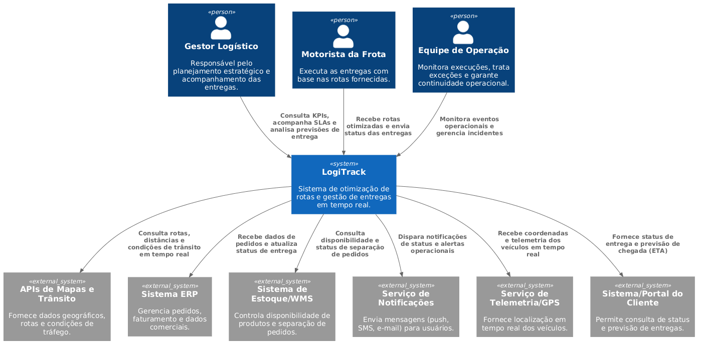
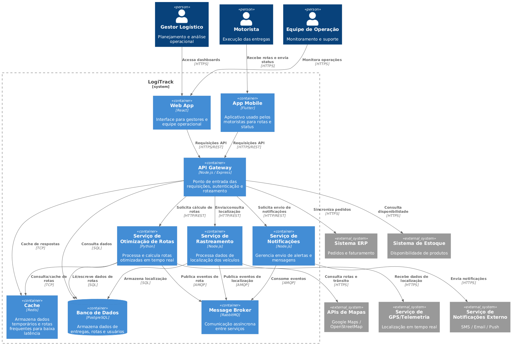

# Mini Projeto "O Arquiteto Decisor" (v4)

**Aluno:** Amábile Honorato Zucchetti\
**Matrícula:** 2310438\
**Link Repositório GitHub (Scaffolding):** `https://github.com/amabilee/logistack-arquitetura`

---

## CICLO 1: Visão e Requisitos (Fase 1)

### 1.1 Resumo do Cenário de Negócio

O **LogiTrack** é um sistema projetado para modernizar as operações de uma empresa de logística que atualmente depende de **planejamento manual de rotas**, o que gera ineficiência, atrasos e dificuldade em cumprir *SLAs de entrega*. O **problema central** está na incapacidade de reagir rapidamente a variáveis dinâmicas, como trânsito, imprevistos operacionais e mudanças de prioridade nas entregas, impactando diretamente o desempenho operacional. A arquitetura proposta substitui esse modelo manual por uma solução baseada em **processamento de dados em tempo real**, permitindo a otimização contínua das rotas com base em grandes volumes de dados geolocalizados. Os principais usuários do sistema são **gestores logísticos**, **motoristas da frota** e **equipes operacionais**, que utilizam a plataforma para planejamento, execução e monitoramento das entregas. O sistema realiza **integração com APIs de mapas** (como Google Maps e OpenStreetMap) e com sistemas corporativos, como **ERP e controle de estoque**. O objetivo de negócio é **reduzir custos operacionais**, **melhorar o cumprimento de SLAs**, aumentar a eficiência das entregas e garantir maior previsibilidade, sustentado por uma arquitetura com foco em **performance, escalabilidade e resiliência**.

### 1.2 Atributos de Qualidade (RNFs) Priorizados

1. **Performance:**  
A performance é crítica porque o sistema substitui o *planejamento manual de rotas* por decisões automatizadas em tempo real. Em cenários com múltiplos veículos em trânsito, qualquer atraso no recálculo de rotas pode resultar em perda de janelas de entrega e quebra de *SLAs*. Do ponto de vista técnico, isso exige **baixa latência (< poucos segundos)** para ingestão de dados de GPS, processamento de eventos e resposta das APIs de roteirização, além de uso de **processamento assíncrono e cache de rotas** para evitar recomputações desnecessárias.
2. **Escalabilidade:**  
A escalabilidade é essencial porque o volume de dados cresce proporcionalmente ao número de veículos, entregas simultâneas e eventos de localização gerados continuamente. Em horários de pico (ex: início de rotas ou redistribuição de entregas), há picos intensos de processamento. A arquitetura deve suportar **escala horizontal**, permitindo adicionar instâncias de serviços de forma dinâmica, especialmente para componentes como **otimização de rotas e ingestão de telemetria**, evitando degradação de performance sob carga elevada.
3. **Resiliência:**  
A resiliência é prioritária devido à forte dependência de **APIs externas de mapas** e à variabilidade da conectividade dos dispositivos móveis dos motoristas. Falhas nesses pontos não podem interromper a operação logística. O sistema deve implementar **fallbacks (ex: uso de rotas previamente calculadas)**, **retry com backoff**, e mecanismos como **circuit breaker**, garantindo continuidade operacional mesmo com falhas parciais.
4. **Confiabilidade:**  
A confiabilidade é crítica porque decisões operacionais (ex: redirecionamento de veículos, comunicação com clientes) dependem diretamente da precisão das informações. Um erro na previsão de entrega ou no status pode gerar custos logísticos e insatisfação do cliente. Tecnicamente, isso exige **consistência dos dados de localização e status**, uso de **processamento idempotente**, além de mecanismos para evitar duplicidade ou perda de eventos no fluxo de dados.
5. **Manutenibilidade:**  
A manutenibilidade é importante porque o domínio do problema envolve evolução constante, como ajustes nos algoritmos de otimização e integração com novos sistemas (ex: novos ERPs ou provedores de mapas). Uma arquitetura pouco flexível aumentaria o custo e o risco dessas mudanças. Por isso, é necessário adotar **modularização clara (ex: microserviços ou serviços bem desacoplados)**, **contratos bem definidos entre componentes (APIs)** e **observabilidade**, permitindo identificar e corrigir falhas rapidamente sem impactar todo o sistema.

### 1.3 Diagrama de Contexto (C4 Nível 1)

### 1.4 Classificação da Estratégia
-   **Classificação:** Balanceada
-   **Justificativa:** A estratégia do LogiTrack é balanceada porque combina inovação no uso de dados em tempo real com tecnologias já consolidadas, como APIs de mapas e sistemas internos de logística. Essa abordagem reduz riscos de falhas críticas, mas ainda garante evolução tecnológica e escalabilidade. O sistema mantém confiabilidade para operações essenciais, sem ser conservador demais nem ousado em excesso.

---

## CICLO 2: Blueprint e Decisões (Fase 2)

### 2.1 Diagrama de Containers (C4 Nível 2)

### 2.2 Estilo Arquitetural Escolhido

O estilo arquitetural adotado para o **LogiTrack** é uma combinação de **Microsserviços** com **arquitetura orientada a eventos (Event-Driven Architecture)**. Essa escolha foi feita para atender diretamente aos requisitos não funcionais críticos do sistema, especialmente **performance, escalabilidade, resiliência e confiabilidade**, considerando o contexto de processamento em tempo real e alto volume de dados geolocalizados.

No modelo de **microsserviços**, o sistema é dividido em serviços independentes (como otimização de rotas, rastreamento e notificações), cada um responsável por uma capacidade de negócio específica e passível de deploy independente. Já o uso de **eventos** (via mensageria) permite desacoplamento entre esses serviços, viabilizando processamento assíncrono e maior tolerância a falhas.

#### Trade-offs Arquiteturais

1. **Escalabilidade vs. Complexidade Operacional**  
   - *Pró:* A arquitetura de microsserviços permite escalar apenas os componentes mais críticos (ex: serviço de otimização de rotas e rastreamento), atendendo picos de carga sem impactar todo o sistema.  
   - *Contra:* Introduz maior complexidade operacional, exigindo gerenciamento de múltiplos serviços, deploy distribuído e observabilidade mais sofisticada.

2. **Resiliência vs. Consistência de Dados**  
   - *Pró:* O uso de arquitetura orientada a eventos (com mensageria) aumenta a resiliência, pois falhas em um serviço não interrompem imediatamente os demais, permitindo reprocessamento de eventos e tolerância a falhas parciais.  
   - *Contra:* Pode levar a **consistência eventual**, o que significa que nem todos os dados estarão sincronizados em tempo real, exigindo cuidados adicionais na modelagem e tratamento de estados.

3. **Performance em Tempo Real vs. Sobrecarga de Comunicação**  
   - *Pró:* A separação de responsabilidades e o uso de processamento assíncrono permitem respostas rápidas para operações críticas, como atualização de localização e cálculo de rotas.  
   - *Contra:* A comunicação entre serviços (via rede e broker) adiciona overhead, podendo impactar latência se não houver estratégias como cache, batching ou otimização de payloads.

4. **Manutenibilidade vs. Complexidade de Desenvolvimento**  
   - *Pró:* Serviços desacoplados facilitam manutenção, evolução de funcionalidades e substituição de tecnologias sem afetar todo o sistema.  
   - *Contra:* Aumenta a complexidade no desenvolvimento, exigindo definição clara de contratos (APIs/eventos), versionamento e testes distribuídos.

#### Fundamentação\
Conforme Pressman (2016) em *Engenharia de Software*, estilos arquiteturais devem ser escolhidos com base nos atributos de qualidade desejados. A combinação de **microsserviços** e **event-driven** é adequada para sistemas distribuídos, orientados a dados e que exigem alta escalabilidade e resiliência, características centrais do LogiTrack.

### 2.3 Architecture Decision Record (ADR) Principal

ADR selecionado:
[ADR-001: Estratégia de Comunicação entre Microsserviços](./adrs/ADR-001-comunicacao-event-driven.md)

---

## CICLO 3: Cloud e Resiliência (Fase 3)
*Preencher e entregar no AVA ao final do Ciclo 3.*

### 3.1 Estratégia de Cloud e Implantação
[Descreva como sua arquitetura será implantada em um ambiente de nuvem (ex: AWS, Azure, GCP). Qual o modelo de serviço (IaaS, PaaS, Serverless)? Como o sistema será escalado e monitorado?]

### 3.2 Análise de Fragilidade e Mitigação
-   **Ponto Frágil:** [Identifique a maior fraqueza ou risco da sua arquitetura em um cenário de produção (ex: falha de um serviço crítico, pico de tráfego inesperado, vulnerabilidade de segurança).]
-   **Mitigação:** [Como você minimizaria esse risco? Quais estratégias de resiliência (ex: circuit breaker, retry, fallback, multi-região) seriam aplicadas?]

### 3.3 Parecer Técnico Final
[Resumo executivo (até 10 linhas) defendendo por que sua arquitetura é a melhor escolha para o cliente, considerando os requisitos de negócio, os RNFs e a estratégia de implantação. Qual o valor agregado da sua solução?]

---

## BÔNUS: Evolução Arquitetural (Gamificação)
*Opcional - Preencher apenas se houver melhoria estrutural documentada no GitHub.*

[Descreva brevemente a melhoria arquitetural que você implementou no seu repositório GitHub para fins de bônus de nota. Referencie a nova ADR e o diagrama atualizado (se houver) no GitHub. Ex: Migração de um componente para Serverless, implementação de um padrão de resiliência, otimização de custo em cloud. **Lembre-se: a melhoria deve ser arquitetural, não apenas textual.**]

---

## Referências Bibliográficas
-   **Pressman, R. S.** (2021). *Engenharia de Software: Uma Abordagem Profissional*. McGraw Hill. (Capítulos selecionados conforme o tema da aula).
-   **Richards, M., & Ford, N.** (2020). *Fundamentals of Software Architecture: An Engineering Approach*. O'Reilly Media.
-   **C4 Model for Software Architecture.** (s.d.). Disponível em: [https://c4model.com/](https://c4model.com/)
-   **Architecture Decision Records (ADRs).** (s.d.). Disponível em: [https://adr.github.io/](https://adr.github.io/)
