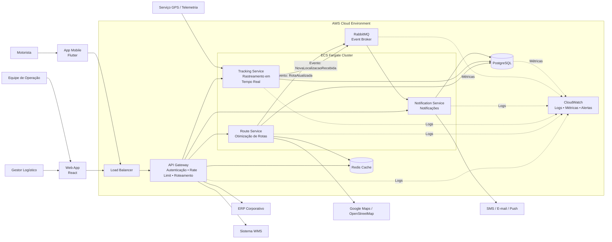

# LogiTrack - Plataforma Inteligente de Gestão Logística

## Visão Executiva

O LogiTrack é uma plataforma de logística inteligente desenvolvida para otimizar o planejamento e monitoramento de entregas em tempo real. O sistema substitui processos manuais de roteirização por uma arquitetura distribuída baseada em microsserviços, permitindo decisões operacionais mais rápidas, redução de custos e melhoria dos indicadores de SLA.

A solução foi evoluída ao longo do projeto para uma arquitetura Cloud Native, preparada para escalabilidade horizontal, alta disponibilidade e resiliência em cenários de alto volume de processamento.

---

## Problema de Negócio

Empresas de logística frequentemente dependem de processos manuais para planejamento de rotas e monitoramento operacional. Essa abordagem gera:

* Baixa eficiência operacional;
* Dificuldade no cumprimento de SLAs;
* Aumento dos custos de transporte;
* Pouca capacidade de reação a eventos em tempo real;
* Baixa previsibilidade das operações.

---

## Solução Proposta

O LogiTrack utiliza:

* Microsserviços;
* Arquitetura orientada a eventos;
* Processamento assíncrono;
* Integração com APIs de mapas;
* Implantação em ambiente de nuvem.

A plataforma realiza rastreamento de veículos, otimização dinâmica de rotas, monitoramento operacional e geração de notificações em tempo real.

---

## Estado Atual da Arquitetura (Fase 4)

A arquitetura atual utiliza:

* Microsserviços desacoplados;
* API Gateway;
* RabbitMQ para mensageria;
* PostgreSQL para persistência;
* Implantação em ambiente AWS;
* Escalabilidade horizontal;
* Estratégias de resiliência baseadas em Circuit Breaker e Retry.

---

## Requisitos Não Funcionais Priorizados

| Atributo         | Prioridade |
| ---------------- | ---------- |
| Performance      | Alta       |
| Escalabilidade   | Alta       |
| Resiliência      | Alta       |
| Confiabilidade   | Alta       |
| Manutenibilidade | Média/Alta |

---

## Diagrama C4 - Containers



---

## Arquitetura Cloud

A solução foi projetada para execução em ambiente AWS utilizando serviços gerenciados que favorecem elasticidade, observabilidade e redução do esforço operacional.

Principais componentes:

* AWS ECS Fargate
* PostgreSQL
* RabbitMQ
* Application Load Balancer
* CloudWatch

---

## Architecture Decision Records (ADR)

### ADR 0001 — Estratégia de Nuvem e Escalabilidade

/docs/adrs/0001-estrategia-nuvem.md

### ADR 0002 — Padrões de Resiliência

/docs/adrs/0002-padrao-resiliencia.md

### ADR 0003 — Modelo de Comunicação

/docs/adrs/0003-modelo-comunicacao.md

---

## Software Architecture Document (SAD)

Documentação arquitetural completa disponível em:

/docs/sad/sad-fase3.md

---

## Estrutura do Repositório

```text
docs/
├── adrs/
├── diagrams/
└── sad/
src/
gold-plating/
```

---

## Como Executar

### Pré-requisitos

* Docker
* Docker Compose

### Execução

```bash
git clone https://github.com/amabilee/logistack-arquitetura

cd logistack-arquitetura

docker compose up
```

---

## Gold Plating

Como evolução arquitetural adicional, foi incorporada uma estratégia de observabilidade distribuída e escalabilidade avançada para ambientes Cloud Native.

Artefatos disponíveis em:

- /gold-plating/observabilidade.md
- /gold-plating/kubernetes-autoscaling.md
- /gold-plating/custo-cloud.md

As melhorias incluem monitoramento distribuído, métricas centralizadas, tracing entre microsserviços e estratégias avançadas de autoescalonamento baseadas em carga e filas de mensageria.

---

## Referências

* Pressman, R. S. Engenharia de Software.
* Richards, Mark; Ford, Neal. Fundamentals of Software Architecture.
* Newman, Sam. Building Microservices.
* AWS Well-Architected Framework.
* C4 Model.
