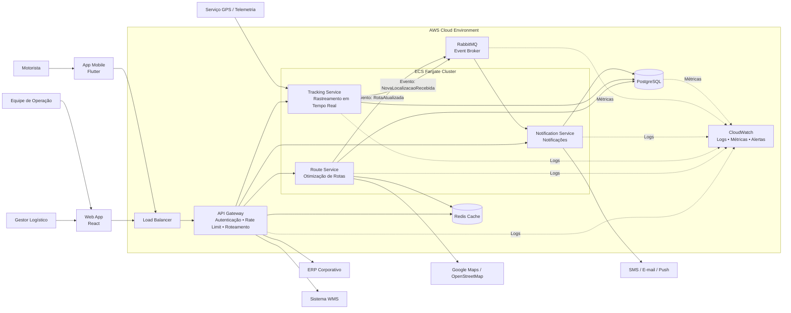

## Diagrama C4 – Nível 4

```mermaid
flowchart LR

    %% Usuários
    Gestor["Gestor Logístico"]
    Operacao["Equipe de Operação"]
    Motorista["Motorista"]

    %% Frontend
    Web["Web App
    React"]

    Mobile["App Mobile
    Flutter"]

    %% Cloud
    subgraph AWS["AWS Cloud Environment"]

        LB["Load Balancer"]

        Gateway["API Gateway
        Autenticação • Rate Limit • Roteamento"]

        subgraph ECS["ECS Fargate Cluster"]

            Route["Route Service
            Otimização de Rotas"]

            Tracking["Tracking Service
            Rastreamento em Tempo Real"]

            Notification["Notification Service
            Notificações"]

        end

        Rabbit["RabbitMQ
        Event Broker"]

        PostgreSQL[("PostgreSQL")]

        Redis[("Redis Cache")]

        CloudWatch["CloudWatch
        Logs • Métricas • Alertas"]

    end

    %% Sistemas Externos
    Maps["Google Maps / OpenStreetMap"]

    ERP["ERP Corporativo"]

    Estoque["Sistema WMS"]

    GPS["Serviço GPS / Telemetria"]

    Push["SMS / E-mail / Push"]

    %% Usuários
    Gestor --> Web
    Operacao --> Web
    Motorista --> Mobile

    %% Entrada
    Web --> LB
    Mobile --> LB

    LB --> Gateway

    %% Serviços
    Gateway --> Route
    Gateway --> Tracking
    Gateway --> Notification

    %% Eventos
    Tracking -->|"Evento: NovaLocalizacaoRecebida"| Rabbit
    Route -->|"Evento: RotaAtualizada"| Rabbit

    Rabbit --> Notification

    %% Persistência
    Route --> PostgreSQL
    Tracking --> PostgreSQL
    Notification --> PostgreSQL

    %% Cache
    Route --> Redis
    Gateway --> Redis

    %% Integrações
    Route --> Maps

    Gateway --> ERP
    Gateway --> Estoque

    GPS --> Tracking

    Notification --> Push

    %% Observabilidade
    Gateway -. Logs .-> CloudWatch
    Route -. Logs .-> CloudWatch
    Tracking -. Logs .-> CloudWatch
    Notification -. Logs .-> CloudWatch
    Rabbit -. Métricas .-> CloudWatch
    PostgreSQL -. Métricas .-> CloudWatch
```