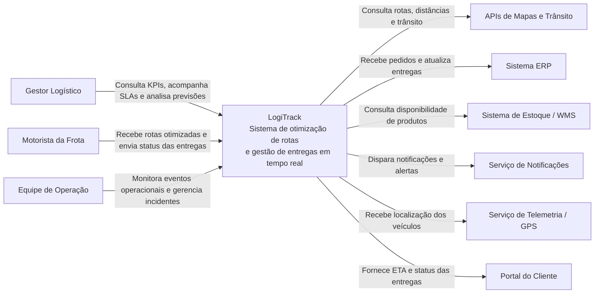
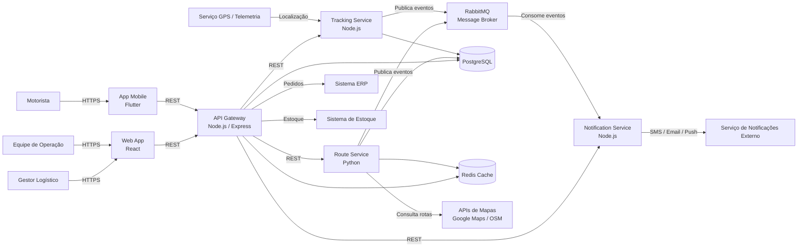

# Software Architecture Document (SAD)

# LogiTrack – Plataforma Inteligente de Gestão Logística

## 1. Introdução

### 1.1 Objetivo

Este documento apresenta a arquitetura de software do LogiTrack, uma plataforma desenvolvida para otimizar operações logísticas através do processamento de dados em tempo real, rastreamento de veículos e otimização dinâmica de rotas.

O objetivo deste documento é descrever as decisões arquiteturais adotadas, os componentes da solução, os requisitos arquiteturais, as estratégias de implantação em nuvem e os mecanismos utilizados para garantir escalabilidade, resiliência, confiabilidade e manutenibilidade.

### 1.2 Escopo

O LogiTrack atende empresas de logística que necessitam monitorar entregas, rastrear veículos, otimizar rotas e responder rapidamente a mudanças operacionais.

A solução permite:

* Monitoramento de veículos em tempo real;
* Otimização dinâmica de rotas;
* Integração com provedores de mapas;
* Comunicação entre equipes operacionais;
* Notificações automáticas de eventos logísticos;
* Acompanhamento de indicadores operacionais.

---

## 2. Contexto de Negócio

Empresas de logística frequentemente dependem de planejamento manual de rotas e acompanhamento operacional descentralizado, gerando atrasos, aumento de custos e dificuldade no cumprimento de SLAs.

O LogiTrack foi concebido para substituir processos manuais por uma plataforma digital baseada em processamento de eventos em tempo real.

A solução utiliza informações de localização, dados de trânsito e eventos operacionais para auxiliar gestores e equipes logísticas na tomada de decisão.

Os principais benefícios esperados são:

* Redução de custos operacionais;
* Melhor utilização da frota;
* Aumento da previsibilidade das entregas;
* Cumprimento dos SLAs;
* Melhor experiência para clientes e operadores.

---

## 3. Requisitos Arquiteturais

### 3.1 Performance

A performance é crítica devido à necessidade de processar continuamente eventos de localização e recalcular rotas em tempo real.

A arquitetura deve garantir:

* Baixa latência;
* Processamento assíncrono;
* Utilização eficiente de recursos computacionais;
* Cache para dados frequentemente acessados.

### 3.2 Escalabilidade

O sistema deve suportar crescimento contínuo do número de veículos, entregas e usuários simultâneos.

A arquitetura deve permitir:

* Escalabilidade horizontal;
* Escalabilidade independente por serviço;
* Elasticidade em períodos de pico.

### 3.3 Resiliência

Falhas em integrações externas ou componentes internos não podem interromper a operação logística.

A arquitetura deve implementar:

* Circuit Breaker;
* Retry com Backoff;
* Fallback;
* Dead Letter Queue.

### 3.4 Confiabilidade

A plataforma deve garantir consistência e integridade das informações utilizadas na tomada de decisão.

Para isso serão adotados:

* Processamento idempotente;
* Persistência confiável;
* Rastreabilidade de eventos;
* Controle de duplicidade.

### 3.5 Manutenibilidade

A arquitetura deve facilitar evolução contínua do sistema.

Serão utilizados:

* Microsserviços desacoplados;
* APIs bem definidas;
* Mensageria;
* Observabilidade centralizada.

---

## 4. Visão Arquitetural

O LogiTrack adota uma arquitetura baseada em Microsserviços combinada com Arquitetura Orientada a Eventos (Event-Driven Architecture).

Cada microsserviço possui responsabilidade específica e pode ser desenvolvido, implantado e escalado independentemente.

A comunicação ocorre através de APIs REST e eventos publicados em um Message Broker.

Os principais componentes da solução são:

* API Gateway;
* Route Service;
* Tracking Service;
* Notification Service;
* RabbitMQ;
* PostgreSQL;
* Serviços externos de mapas.

Essa abordagem foi escolhida para atender aos requisitos de escalabilidade, resiliência e performance definidos para o projeto.

---

## 5. Diagrama de Contexto (C4 – Nível 1)

---

## 6. Diagrama de Containers (C4 – Nível 2)

---

## 7. Arquitetura Cloud

### 7.1 Estratégia de Implantação

A solução será implantada em ambiente AWS utilizando uma estratégia baseada em Platform as a Service (PaaS).

Os microsserviços serão executados em containers gerenciados pelo AWS ECS Fargate.

Essa abordagem reduz o esforço operacional e simplifica a escalabilidade da plataforma.

### 7.2 Componentes da Infraestrutura

* AWS ECS Fargate;
* Application Load Balancer;
* PostgreSQL Gerenciado;
* RabbitMQ;
* CloudWatch;
* VPC Privada;
* Security Groups.

### 7.3 Benefícios da Estratégia

* Alta disponibilidade;
* Escalabilidade horizontal;
* Menor esforço operacional;
* Redução de riscos de infraestrutura;
* Facilidade de monitoramento.

---

## 8. Comunicação entre Serviços

### 8.1 Comunicação Síncrona

A comunicação síncrona será utilizada entre:

* Frontend;
* Aplicativo móvel;
* API Gateway.

Tecnologias:

* REST;
* HTTP/HTTPS;
* JSON.

### 8.2 Comunicação Assíncrona

A comunicação entre microsserviços ocorrerá predominantemente através de eventos.

Tecnologia utilizada:

* RabbitMQ.

Exemplos de eventos:

* NovaLocalizacaoRecebida;
* RotaAtualizada;
* EntregaConcluida;
* NotificacaoEnviada.

Essa abordagem reduz o acoplamento entre componentes e melhora a escalabilidade da plataforma.

---

## 9. Persistência de Dados

O sistema utilizará PostgreSQL como banco de dados principal.

A escolha foi motivada por:

* Maturidade da tecnologia;
* Confiabilidade;
* Consistência transacional;
* Suporte a consultas complexas.

Os dados armazenados incluem:

* Informações de veículos;
* Entregas;
* Rotas;
* Eventos operacionais;
* Histórico de rastreamento.

---

## 10. Estratégias de Resiliência

### 10.1 Circuit Breaker

Protege a aplicação contra falhas prolongadas em integrações externas.

Exemplo:

* API de Mapas indisponível.

### 10.2 Retry com Backoff

Permite recuperação automática de falhas temporárias.

### 10.3 Fallback

Em caso de indisponibilidade de serviços externos, o sistema utilizará informações previamente armazenadas.

Exemplo:

* Última rota válida disponível.

### 10.4 Dead Letter Queue

Mensagens que não puderem ser processadas serão direcionadas para filas específicas de tratamento.

---

## 11. Observabilidade

A plataforma implementará mecanismos de observabilidade para monitoramento contínuo.

### Logs

Todos os serviços enviarão logs para uma plataforma centralizada.

### Métricas

Serão monitorados:

* Tempo de resposta;
* Taxa de erros;
* Uso de CPU;
* Uso de memória;
* Volume de mensagens nas filas.

### Tracing

Será adotado rastreamento distribuído para acompanhar requisições entre microsserviços.

---

## 12. Segurança

### Autenticação

A autenticação será realizada através de tokens JWT.

### Comunicação Segura

Toda comunicação utilizará HTTPS/TLS.

### Controle de Acesso

O acesso será controlado por perfis de usuário.

Exemplos:

* Gestor Logístico;
* Operador;
* Motorista.

### Proteção de APIs

O API Gateway será responsável por:

* Autenticação;
* Rate Limiting;
* Controle de acesso.

---

## 13. Estratégia de Escalabilidade

### Escalabilidade Horizontal

Os microsserviços poderão ser escalados independentemente.

Exemplos:

* Tracking Service;
* Route Service;
* Notification Service.

### Auto Scaling

O aumento de instâncias será baseado em:

* Uso de CPU;
* Uso de memória;
* Volume de mensagens no RabbitMQ;
* Número de requisições simultâneas.

### Benefícios

* Melhor aproveitamento de recursos;
* Redução de custos;
* Maior disponibilidade.

---

## 14. ADRs Relacionados

### ADR 0001 – Estratégia de Nuvem e Escalabilidade

Define a utilização de AWS ECS Fargate e escalabilidade horizontal.

### ADR 0002 – Estratégias de Resiliência

Define a utilização de Circuit Breaker, Retry, Fallback e Dead Letter Queue.

### ADR 0003 – Modelo de Comunicação

Define a adoção de arquitetura orientada a eventos utilizando RabbitMQ.

---

## 15. Análise de Fragilidade e Mitigação

### Principal Fragilidade

A principal fragilidade da arquitetura é a dependência de serviços externos de mapas para cálculo de rotas.

Falhas prolongadas nessas integrações podem impactar diretamente a capacidade de otimização logística.

### Estratégias de Mitigação

* Circuit Breaker;
* Retry com Backoff;
* Cache de rotas;
* Fallback para última rota válida;
* Monitoramento contínuo;
* Alertas automáticos.

---

## 16. Parecer Técnico Final

A arquitetura proposta para o LogiTrack combina microsserviços, comunicação orientada a eventos e implantação em nuvem para atender aos requisitos de performance, escalabilidade, resiliência e confiabilidade.

A utilização de RabbitMQ reduz o acoplamento entre componentes e aumenta a capacidade de processamento distribuído. A adoção de AWS ECS Fargate permite escalabilidade horizontal sob demanda, enquanto os mecanismos de Circuit Breaker, Retry e Fallback garantem continuidade operacional diante de falhas externas.

A solução fornece uma base tecnológica moderna, preparada para crescimento contínuo da operação logística e alinhada às melhores práticas de arquitetura de software distribuído.

---

## 17. Referências

PRESSMAN, Roger S. Engenharia de Software: Uma Abordagem Profissional.

RICHARDS, Mark; FORD, Neal. Fundamentals of Software Architecture.

NEWMAN, Sam. Building Microservices.

NYGARD, Michael. Release It!.

AWS Well-Architected Framework.

C4 Model for Software Architecture.

Architecture Decision Records (ADR).
